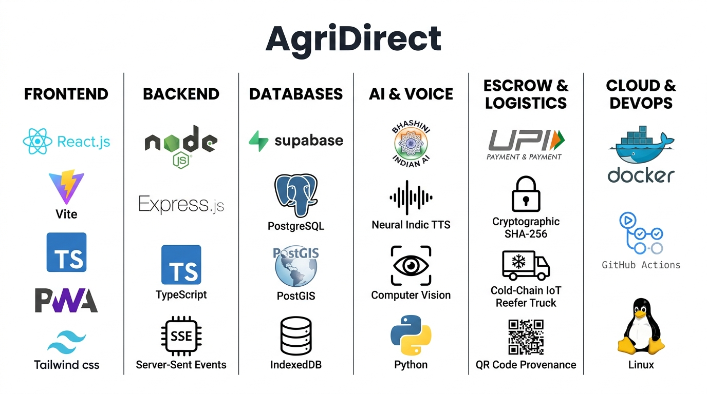

# AgriDirect — Sovereign Kisan-to-Grahak Infrastructure
> **Department of Consumer Affairs (DoCA) — Problem Statement 26033**  
> Direct Kisan-to-Grahak Disintermediation Grid with AI Logistics, Transparent Pricing, Cryptographic Provenance, and 22-Language Vernacular Voice AI

---

## 1. Executive Summary & Core Mission

**AgriDirect** eliminates the multi-tier APMC middleman chain (where farmers traditionally capture only ~28% of the final consumer rupee) by connecting farmers directly to retail consumers and bulk institutional buyers through an electric cold-chain aggregation grid.

### The Sovereign Mathematical Pricing Identity
Every transaction on AgriDirect strictly satisfies the 3-component fair value formula (verified to 2 decimal places):
$$\text{Consumer Price (100\%)} = \text{Farmer Realization (76\%)} + \text{Cold Logistics (16\%)} + \text{Platform Fee (8\%) }$$

* **Farmer Realization (76%)**: Transferred directly to the farmer's UPI account with a T+0 instant settlement protocol upon doorstep delivery.
* **Cold Logistics (16%)**: Powers multi-stop milk runs using active temperature-controlled electric vehicles (Tata Ace EV Reefer, 4.2°C lock).
* **Platform & Quality Verification (8%)**: Covers multi-spectral AI vision quality assaying, escrow protection, and cloud ledger infrastructure.

---

## 2. System Architecture

<p align="center">
  
</p>

```
┌────────────────────────────────────────────────────────────────────────────────┐
│                       AgriDirect Client PWA (React 19)                         │
│  - Stitch Design Tokens (Plus Jakarta Sans, Inter, Material Symbols Outlined)  │
│  - 22 Eighth Schedule Official Indian Languages + English UI Internationalization│
│  - RTL Layout System for Urdu (اردو), Sindhi (سنڌي), and Kashmiri (کٲشُر)      │
│  - Multilingual AI Voice Sahayak Widget with Live Audio Waveform Telemetry    │
│  - Workbox PWA Service Worker Precaching (sw.js) & Web App Manifest            │
│  - IndexedDB Local Storage Vault (agridirect_offline_vault) for Offline Drafts │
└───────────────────────┬───────────────────────────────┬────────────────────────┘
                        │ HTTP / REST                   │ SSE Event Stream
                        ▼                               ▼
┌────────────────────────────────────────────────────────────────────────────────┐
│                   AgriDirect Express Gateway (/api/v1)                         │
│  - Helmet Security Headers & Strict CORS                                      │
│  - JWT Authentication & 5-Role Hierarchical RBAC Middleware                    │
│  - Server-Sent Events (SSE) Real-Time Pub/Sub Notification Engine              │
│  - Sovereign Voice AI Engine (AI4Bharat / Bhashini ULCA Pipeline Integration)  │
└───────┬───────────────┬───────────────┬───────────────┬───────────────┬────────┘
        │               │               │               │               │
        ▼               ▼               ▼               ▼               ▼
┌──────────────┐┌──────────────┐┌──────────────┐┌──────────────┐┌──────────────┐
│  Auth & RBAC ││ Market & Lot ││ Price Engine ││ Logistics &  ││ Voice AI &   │
│  Controllers ││  Catalog API ││ & Agmarknet  ││ CVRPTW Solver││ Provenance   │
└───────┬──────┘└───────┬──────┘└───────┬──────┘└───────┬──────┘└───────┬──────┘
        │               │               │               │               │
        └───────────────┴───────┬───────┴───────────────┴───────────────┘
                                ▼
┌────────────────────────────────────────────────────────────────────────────────┐
│            Dual-Mode ACID Data Layer (server/src/db/index.ts)                  │
│  - Mode 1: Live PostgreSQL 16 + PostGIS cluster with transactional row locks   │
│  - Mode 2: Resilient In-Memory Datastore with deterministic seed data          │
└────────────────────────────────────────────────────────────────────────────────┘
```

---

## 3. Multilingual Interface System & 22-Language AI Voice Assistant

AgriDirect provides native accessibility across all **22 Eighth Schedule Official Indian Languages plus English**, ensuring sovereign digital inclusion for rural farmers, urban consumers, and logistics pilots alike.

### A. Dynamic Screen Language Switching
* **Zero Page Reload**: Instantaneous DOM updates using the reactive `useTranslation()` React hook and strongly typed `TranslationSchema` catalog without interrupting active user workflows.
* **Persistent Preferences**: Language selection is saved locally in `localStorage` (`agridirect_lang`) and synchronized with the user's Supabase account profile (`profiles.preferred_language`).
* **Complete RTL (Right-to-Left) Architecture**:
  * Automatically sets `<html dir="rtl" lang="...">` when selecting Perso-Arabic scripts: **Urdu (`ur`)**, **Sindhi (`sd`)**, or **Kashmiri (`ks`)**.
  * Dynamic Perso-Arabic font family overrides (`Noto Naskh Arabic`, `sans-serif`).
  * `.rtl-flip` CSS transform mirrors directional navigation icons while preserving numbers and currency symbols (`₹`).

### B. Conversational AI Voice Sahayak
* **Floating Launcher & Responsive Drawer**: Floating widget positioned at the bottom right corner with animated status beacon and one-click expand/collapse.
* **Dual-Layer Speech Recognition (ASR)**:
  * *Layer 1 (Browser Web Speech API)*: Native speech recognition for supported regional dialects (`hi-IN`, `te-IN`, `mr-IN`, `ta-IN`, `kn-IN`, `bn-IN`, `gu-IN`, `pa-IN`, `ur-IN`, `en-IN`).
  * *Layer 2 (Server Bhashini Fallback)*: Audio stream recording via `MediaRecorder` routed through `/api/v1/voice/process-intent` for full dialect coverage.
* **Dual-Layer Speech Synthesis (TTS)**:
  * *Layer 1 (Browser Web Speech Synthesis)*: Spoken audio readout via `SpeechSynthesisUtterance` matching regional Indic voice tags.
  * *Layer 2 (Server Synthesizer)*: Base64 audio synthesized directly from `/api/v1/voice/assistant/chat` and `/api/v1/voice/synthesize`.
* **Deep Agricultural Intelligence**:
  * **Live APMC Mandi Benchmarks**: Instant comparisons between mandi benchmark quotes and AgriDirect direct farm gate rates (e.g., Tomato APMC ₹21.50 vs AgriDirect ₹35.00; +63% farmer gain).
  * **76% Direct Disintermediation**: Plain-language explanation of 7 eliminated middleman layers.
  * **4°C Active Cold Chain**: Real-time IoT temperature telemetry and CVRPTW multi-stop route guidance.
  * **Cryptographic Escrow Security**: Explains the 30% advance booking lock and 70% automatic QR doorstep release.
  * **Hands-Free Voice Harvest Listing**: Step-by-step guidance for voice-activated lot publishing.
* **Live Waveform Telemetry**: Real-time dynamic frequency waveform visualizer (`AudioWaveform.tsx`) reflecting microphone input and audio playback levels.
* **Flexible Language Modes**: Lock assistant to the active screen language or independently select any of the 23 supported languages.

| Code | Language | Script | Direction | Speech Rec Code | TTS Code |
| :--- | :--- | :--- | :--- | :--- | :--- |
| `en` | English | Latin | LTR | `en-IN` | `en-IN` |
| `hi` | Hindi (हिन्दी) | Devanagari | LTR | `hi-IN` | `hi-IN` |
| `mr` | Marathi (मराठी) | Devanagari | LTR | `mr-IN` | `mr-IN` |
| `te` | Telugu (తెలుగు) | Telugu | LTR | `te-IN` | `te-IN` |
| `ta` | Tamil (தமிழ்) | Tamil | LTR | `ta-IN` | `ta-IN` |
| `kn` | Kannada (ಕನ್ನಡ) | Kannada | LTR | `kn-IN` | `kn-IN` |
| `ur` | Urdu (اردو) | Perso-Arabic | **RTL** | `ur-IN` | `ur-IN` |
| `bn` | Bengali (বাংলা) | Bengali | LTR | `bn-IN` | `bn-IN` |
| `gu` | Gujarati (ગુજરાતી) | Gujarati | LTR | `gu-IN` | `gu-IN` |
| `pa` | Punjabi (ਪੰਜਾਬੀ) | Gurmukhi | LTR | `pa-IN` | `pa-IN` |
| `ml` | Malayalam (മലയാളം) | Malayalam | LTR | `ml-IN` | `ml-IN` |
| `or` | Odia (ଓଡ଼ିଆ) | Odia | LTR | `or-IN` | `or-IN` |
| `as` | Assamese (অসমীয়া) | Bengali | LTR | `as-IN` | `as-IN` |
| `ne` | Nepali (नेपाली) | Devanagari | LTR | `ne-NP` | `ne-NP` |
| `kok` | Konkani (कोंकणी) | Devanagari | LTR | `kok-IN` | `kok-IN` |
| `sd` | Sindhi (سنڌي) | Perso-Arabic | **RTL** | `sd-IN` | `sd-IN` |
| `ks` | Kashmiri (کٲشُر) | Perso-Arabic | **RTL** | `ks-IN` | `ks-IN` |
| `mai` | Maithili (मैथिली) | Devanagari | LTR | `mai-IN` | `mai-IN` |
| `sa` | Sanskrit (संस्कृतम्) | Devanagari | LTR | `sa-IN` | `sa-IN` |
| `sat` | Santali (ᱥᱟᱱᱛᱟᱲᱤ) | Ol Chiki | LTR | `sat-IN` | `sat-IN` |
| `doi` | Dogri (डोगरी) | Devanagari | LTR | `doi-IN` | `doi-IN` |
| `mni` | Manipuri (মৈতৈলোন্) | Meetei Mayek | LTR | `mni-IN` | `mni-IN` |
| `brx` | Bodo (बड़ो) | Devanagari | LTR | `brx-IN` | `brx-IN` |

---

## 4. The 5 Enterprise Persona Portals

AgriDirect unifies 5 stakeholder perspectives onto a single real-time ledger:

1. **Kisan (Farmer)**:
   - Vernacular step-by-step harvest listing wizard supporting 22 Indian languages.
   - Hands-free voice AI recording with regional numeral and unit normalization (Quintals, Mann, Bori).
   - Real-time AI quality assay simulation (Grade A+, 96.4% score, Brix 18.2).
   - GPS farmgate geostamp and instant UPI payout estimate (76% net realization).
   - Offline IndexedDB persistence vault with automated background synchronization.
2. **Grahak (Retail Consumer)**:
   - 7-tier APMC middleman breakdown comparison showing direct consumer savings.
   - Farmgate direct cart with itemized 76/16/8 audit ledger.
   - Doorstep delivery verification with cryptographic QR scanner.
3. **Bulk Institutional Buyer (HoReCa / Supermarkets)**:
   - Forward contract bookings with volume discount tiers.
   - Multi-quintal procurement with corporate credit line and escrow protection.
4. **Reefer Logistics Pilot**:
   - Capacitated Vehicle Routing Problem with Time Windows (CVRPTW) Clarke-Wright solver.
   - Multi-stop farmgate milk runs for 1.2-tonne Tata Ace EV Reefer fleets.
   - Active sensor telemetry (4.2°C temperature lock, strictly < 8°C).
   - Geofence waypoint check-in and weight verification.
5. **Government Nodal Admin (DoCA / APMC)**:
   - Live Mandi spot quote ticker (Onion Lasalgaon, Tomato Nashik, Alphonso Ratnagiri).
   - Regional 30-day demand vs supply predictive curves and urban deficit alerts.
   - Dispute arbitration console with automated 48-hour escrow freeze and resolution.

---

## 5. Cryptographic Provenance & Escrow Lifecycle

```
[ Farm Harvest ] ──(SHA-256)──> [ AI Quality Assay ] ──(SHA-256)──> [ Reefer Transit ]
(GPS 19.99° N, 73.78° E)       (96.4% Grade-A Sealed)             (4.2°C Active Lock)
                                                                            │
                                                                         (SHA-256)
                                                                            │
[ Doorstep Settlement ] <──(SHA-256)── [ Hub Docking / Advance ] <──────────┘
(70% Final Payout via UPI)             (30% Advance Payout via UPI)
```

1. **Split Advance Release**: When harvest lots dock at the aggregation hub, 30% advance payout is automatically released to the farmer (`SPLIT_ADVANCE_RELEASED`).
2. **Doorstep Final Settlement**: When the consumer scans the tamper-evident QR code at delivery, the remaining 70% payout is released instantly via UPI (`T+0_INSTANT_UPI`).
3. **Dispute Lock**: If a defect is reported, escrow is locked (`DISPUTE_LOCKED`), preventing fund disbursement until arbitrator review.

---

## 6. Getting Started

### Prerequisites
- **Node.js**: `>= 20.0.0`
- **npm**: `>= 10.0.0`
- **Python**: `>= 3.10` (optional, for standalone `ai-service`)

### Installation
```bash
# Clone the repository
git clone https://github.com/doca/agridirect.git
cd agridirect

# Install root dependencies
npm install

# Install client and server packages
npm --prefix server install
npm --prefix client install
```

### Environment Configuration
Copy `.env.example` to `.env`:
```bash
cp .env.example .env
```
Configure your Supabase credentials in `.env`:
```env
VITE_SUPABASE_URL=https://your-project-id.supabase.co
VITE_SUPABASE_ANON_KEY=your-anon-key-here
```

### Supabase Database & Auth Setup
1. Create a project at [supabase.com](https://supabase.com).
2. Under **Project Settings -> API**, copy your **Project URL** and **`anon` public key** into `.env`.
3. In the **SQL Editor**, execute the migration scripts in order:
   - `supabase/migrations/001_initial_schema.sql` (Tables, Enums, Triggers)
   - `supabase/migrations/002_rls_policies.sql` (Row Level Security)
   - `supabase/migrations/003_indexes.sql` (Performance Indexes)
   - `supabase/seed.sql` (Hubs and Baseline Models)
4. Under **Authentication -> Providers -> Email**, enable Email OTP provider.

### Running Development Servers
```bash
# Concurrently start backend (port 5000) and frontend PWA (port 3000)
npm run dev
```
- Client PWA: `http://localhost:3000`
- Server API: `http://localhost:5000/api/v1`
- API Health: `http://localhost:5000/api/health`

---

## 7. Comprehensive Test Suite

AgriDirect includes **58 automated tests across 11 suites** with 100% pass rate:

```bash
# Execute the full multi-package test pipeline from root
npm test
```

### Test Suite Breakdown:
1. **Database & Concurrency Layer**: Row locks, ACID transactional scope, inventory reservation, and pricing formula identity.
2. **Authentication & RBAC**: Registration, email OTP/password login, JWT verification, and role-based endpoint guards (403 Forbidden).
3. **Marketplace & Pricing Catalog**: Paginated listing queries, category filters, Agmarknet spot benchmarks, and checkout reservation.
4. **AI Demand Forecasting**: 30-day predictive demand vs arrival curves, confidence intervals, and micro-climate IoT telemetry.
5. **Cold-Chain Logistics & CVRPTW**: Multi-stop route optimization, vehicle capacity constraints, CO2 reduction metrics, and telemetry patching.
6. **Real-time Notifications (SSE)**: Event streaming, 25-second keep-alive heartbeats, and targeted role dispatching.
7. **Cryptographic Provenance & Escrow**: SHA-256 chain verification, tamper detection, 30% advance release, doorstep delivery confirmation, and dispute arbitration.
8. **Vernacular Voice AI & Conversational Assistant**: 22 Eighth Schedule languages + English, Indic numeral conversion (Devanagari, Gurmukhi, Gujarati, Telugu), regional unit parsing (Quintal, Mann, Bori), speech synthesis, and `/api/v1/voice/assistant/chat` intent handling.
9. **End-to-End Persona Lifecycle**: Comprehensive 7-stage sequential integration simulating Kisan, AI, Grahak, Driver, and Admin.
10. **Client PWA IndexedDB Vault**: Offline harvest drafting, unsynced queue filtering, idempotency preservation, and offline spot price caching.
11. **Performance Benchmark & Concurrency Stress**: 50 parallel checkout requests preventing overselling, 100 randomized pricing calculations, PWA manifest and service worker compliance, and DoCA SLA latency audit.

---

## 8. Production Build

```bash
# Compiles both TypeScript server and Vite PWA production bundle
npm run build
```

Production output:
- `server/dist/`: Compiled NodeNext ES module server bundle.
- `client/dist/`: Production Vite PWA build with precached service worker (`sw.js`), Workbox runtime caching, and optimized assets.

---

## 9. REST API Reference

| Method | Endpoint | Description | Auth / Role |
|:-------|:---------|:------------|:------------|
| `POST` | `/api/v1/auth/register` | Register new user with email/phone & role | Public |
| `POST` | `/api/v1/auth/login` | Login with credentials & JWT issue | Public |
| `GET`  | `/api/v1/auth/me` | Current authenticated user profile | Authenticated |
| `POST` | `/api/v1/voice/assistant/chat` | 22-language conversational AI assistant | Public |
| `POST` | `/api/v1/voice/process-intent` | Vernacular audio/text slot extraction | Public |
| `POST` | `/api/v1/voice/synthesize` | Indic vernacular speech synthesis | Public |
| `GET`  | `/api/v1/voice/languages` | Supported 22 Indian languages metadata | Public |
| `GET`  | `/api/v1/marketplace/listings` | Paginated catalog with category filters | Public |
| `GET`  | `/api/v1/listings/:id` | Detailed listing assay & farmer info | Public |
| `POST` | `/api/v1/listings` | Publish new harvest listing | `FARMER`, `FPO_ADMIN` |
| `GET`  | `/api/v1/pricing/calculate` | Transparent 76/16/8 breakdown calculator | Public |
| `GET`  | `/api/v1/pricing/mandi-benchmark` | Agmarknet spot market quote ticker | Public |
| `POST` | `/api/v1/orders` | Place order with atomic escrow reservation | `BULK_BUYER`, `RETAIL_CONSUMER` |
| `POST` | `/api/v1/orders/:id/release-advance` | Release 30% advance payout on hub intake | `FPO_ADMIN`, `GOVT_ADMIN` |
| `POST` | `/api/v1/orders/:id/verify-delivery` | Release 70% final payout on QR delivery | `RETAIL_CONSUMER`, `BULK_BUYER` |
| `POST` | `/api/v1/orders/:id/dispute` | Freeze escrow and initiate dispute | `RETAIL_CONSUMER`, `BULK_BUYER` |
| `POST` | `/api/v1/orders/:id/resolve-dispute` | Arbitrate dispute (Refund or Release) | `GOVT_ADMIN`, `FPO_ADMIN` |
| `GET`  | `/api/v1/forecasts` | 30-day demand vs supply forecast | Public |
| `GET`  | `/api/v1/forecasts/telemetry` | Agro-climate & cold storage telemetry | Public |
| `GET`  | `/api/v1/logistics/trips` | Active & scheduled reefer milk runs | Public |
| `POST` | `/api/v1/logistics/optimize` | CVRPTW route optimization solver | Public |
| `PATCH`| `/api/v1/logistics/trips/:id/telemetry` | Update reefer temperature & waypoints | `LOGISTICS_DRIVER` |
| `GET`  | `/api/v1/notifications/stream` | Server-Sent Events real-time stream | Public / Authenticated |
| `POST` | `/api/v1/notifications/broadcast` | Targeted / broadcast alert dispatch | `GOVT_ADMIN` |
| `GET`  | `/api/v1/provenance/sample` | Sample 5-stage verified provenance batch | Public |
| `GET`  | `/api/v1/provenance/verify/:hash` | Cryptographically verify SHA-256 hash | Public |

---

## 10. License & Attribution

Built for the **Department of Consumer Affairs (DoCA)** under Problem Statement 26033.  
Licensed under the Apache License 2.0.
